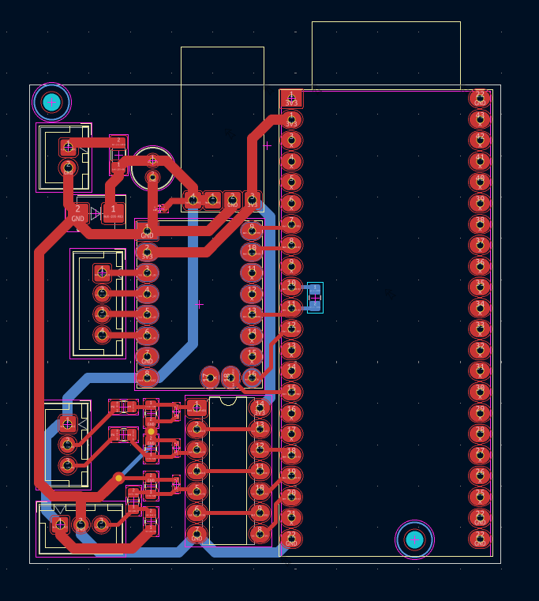
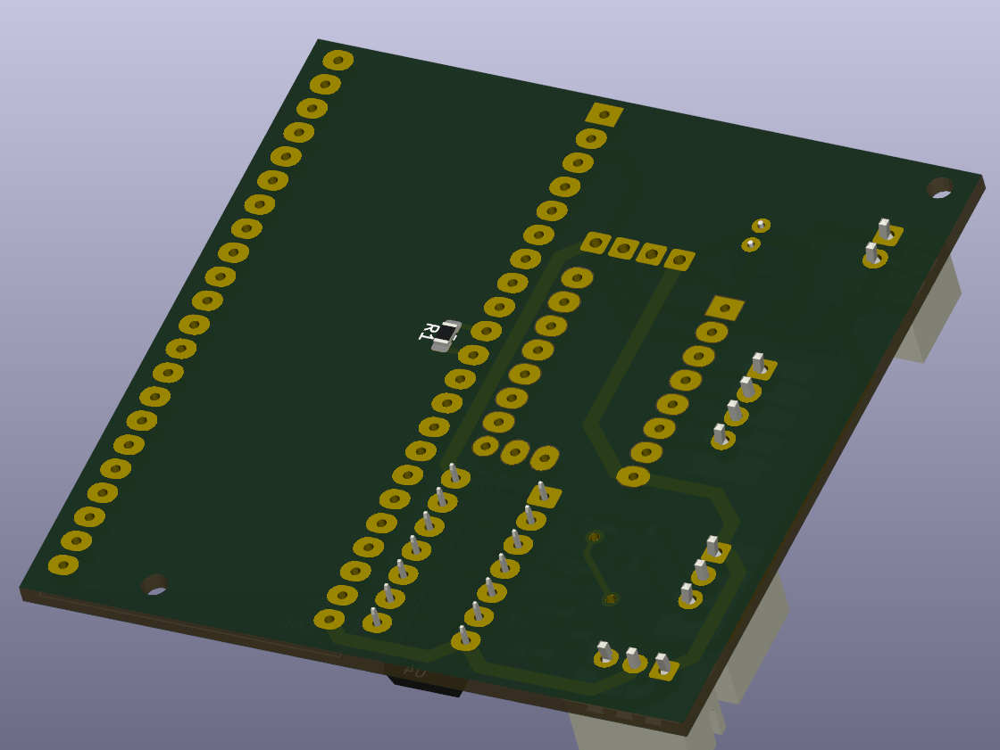

# Electronics Hardware

This folder contains the PCB and electronics design files for the window blinds controller.

The electronics are built around an ESP32-S3 development board, a TMC2209 stepper motor driver, a 12 V to 5 V buck converter, input protection, button/sensor connectors, and dual-inverter Schmitt-trigger input paths.

## Schematics

## Main electronics

| Component                  | Qty | Value / Part                | Purpose                                                                 |
| -------------------------- | --: | --------------------------- | ----------------------------------------------------------------------- |
| ESP32-S3 development board |   1 | `ESP32-S3-DEVKITC-1-N16R8V` | Main MCU, firmware, Wi-Fi, MQTT, GPIO control                           |
| Stepper driver             |   1 | `TMC2209 SilentStepStick`   | Stepper motor driver with UART configuration and DIAG/StallGuard output |
| Buck converter             |   1 | 12 V to 3 V DC-DC buck      | Generates 3 V supply from the 12 V input                                |
| Schmitt trigger            |   1 | `74HC14`                    | Cleans three input signals with two inverter gates per signal            |
| TVS diode                  |   1 | `SMBJ15A`                   | 12 V input transient protection                                         |
| Polyfuse                   |   1 | 2 A                         | Input overcurrent protection                                            |

## Passive components

| Component type | Qty | Value  |
| -------------- | --: | ------ |
| Capacitors     |   4 | 100 nF |
| Capacitor      |   1 | 470 µF |
| Resistors      |   2 | 1 kΩ   |
| Resistors      |   3 | 10 kΩ  |
| Resistors      |   3 | 3.3 kΩ |

## Connectors

| Connector    | Qty | Purpose                                           |
| ------------ | --: | ------------------------------------------------- |
| 2-pin JST-XH |   1 | Power input                                       |
| 4-pin JST-XH |   1 | External wiring / motor-driver related connection |
| 3-pin JST-XH |   1 | External input buttons connection                  |
| 3-pin JST-XH |   1 | NJK-5002C home sensor connection                  |

## Conditioned input logic

Each external input passes through two gates of the 74HC14. The two inversions
cancel, so the ESP32-S3 sees the same logical polarity as the signal entering the
first gate. The final gate is a 3.3 V push-pull output, so the firmware keeps the
ESP32 internal pull resistors disabled.

| Input       | ESP32-S3 pin | Pre-Schmitt idle | Pre-Schmitt active | ESP32 idle | ESP32 active | Activation edge |
| ----------- | -----------: | ---------------: | -----------------: | ---------: | -----------: | --------------: |
| Up button   |     `GPIO12` |              LOW |               HIGH |        LOW |          HIGH |          Rising |
| Down button |     `GPIO13` |              LOW |               HIGH |        LOW |          HIGH |          Rising |
| Home sensor |     `GPIO14` |             HIGH |                LOW |       HIGH |           LOW |         Falling |

## External hardware

The PCB is designed to work with the following external hardware:

| Part                                           | Notes                                                |
| ---------------------------------------------- | ---------------------------------------------------- |
| 12 V, 3 A power supply adapter                 | Main power input for the controller and motor system |
| NEMA 17 stepper motor `17HS4401`               | Stepper motor used to drive the blinds mechanism     |
| GREATZT NJK-5002C Hall effect proximity sensor | Home/reference sensor for calibration                |

Before choosing the motor and power supply, the weight and friction of the specific blinds should be checked. Heavier blinds, tight mechanisms, or higher-friction rope systems may require more torque, different gearing, or a stronger motor/driver setup.

## Design notes

The current PCB uses development-board style modules for the ESP32-S3, TMC2209 SilentStepStick, and DC-DC buck converter.

This made the prototype easier to build and debug because those modules were available during development. If space is critical, these modules could be replaced with direct SMD implementations in a future PCB revision.

Possible future optimizations:

* replace ESP32-S3 DevKit with the ESP32-S3 module (or any other not so overpowerd ESP) directly on the PCB
* replace TMC2209 SilentStepStick with the bare TMC2209 IC and required support components
* replace the buck converter module with an onboard SMD regulator circuit
* reduce connector size or move connectors based on the final enclosure
* optimize PCB shape for the mechanical case

  
  
  

## Safety note

This board controls a motorized mechanism. Before installation, verify:

* correct supply voltage and polarity
* current rating of the power adapter
* stepper motor current settings
* fuse/protection behavior
* connector wiring
* home sensor behavior
* motor direction
* stall detection
* mechanical end stops

Do not operate the blinds unattended until calibration, stall detection, and fault handling have been tested on the real mechanism.
