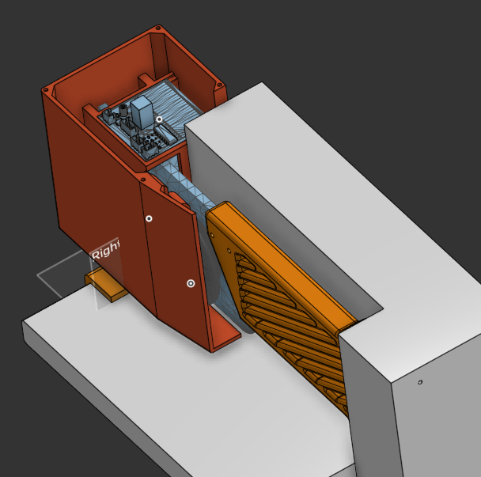

# Mechanical Hardware

This folder contains the mechanical design files for the window blinds controller.

The design includes CNC-machined aluminium parts, 3D printed holders, and a 3D printed electronics enclosure.

  
  

## Main parts

| Part              | Manufacturing method        | Purpose                                                        |
| ----------------- | --------------------------- | -------------------------------------------------------------- |
| Motor/rope holder | CNC aluminium               | Holds the stepper motor and rope drive mechanism               |
| Front holder      | 3D printed or CAD reference | Supports the aluminium holder assembly                         |
| Back holder       | 3D printed or CAD reference | Supports the aluminium holder assembly                         |
| Electronics case  | 3D printed                  | Holds the PCB, homing sensor, wiring, and sound absorbing foam |
| Cover             | 3D printed                  | Removable cover for access and future upgrades                 |
| 1:8 pitch timing belt   | bought online	  | increases available torque at the rope mechanism               |

## Design notes

The aluminium motor/rope holder was CNC machined. The initial plan was to use only this aluminium part and mount it directly to the wall. Due to limited available space around the window and blinds, additional front/back holder parts were added around it.

The aluminium holder could also be 3D printed, or redesigned as a combined part together with the front and/or back holder, depending on the mounting constraints.

The overall mechanical design is probably overengineered and could be optimized. The best final shape depends strongly on the specific window frame, blind type, available mounting space, and required torque.

## Drive mechanism

A 1:8 pitch timing belt reduction is used between the stepper motor and the rope drive.

This increases available torque at the rope mechanism and gives the motor more control over blind movement.

## Fasteners

The assembly uses a few M4 bolts and screws. Exact lengths depend on the final printed/CNC part thickness and mounting surface.

## Electronics case

The electronics case is intentionally slightly larger than the minimum PCB size.

It includes space for:

* the main PCB
* homing sensor mounting
* PCB holders
* wiring clearance
* sound absorbing foam

The extra space was added to reduce noise and make the internal layout easier to service or modify.

