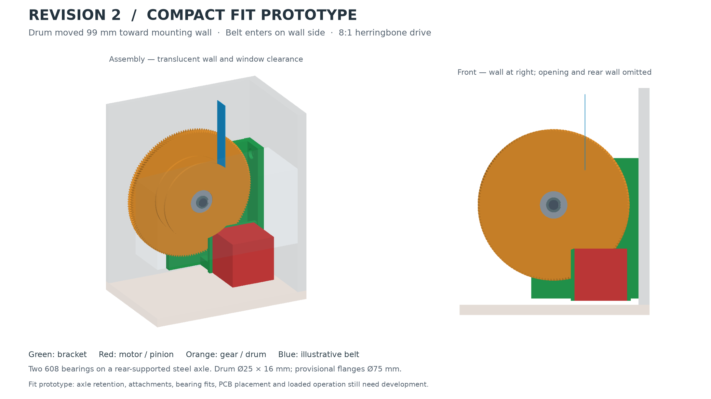

# Compact mechanical fit prototype

This model follows the user's coloured sketch: a replacement wall-mounted L
holder carries a NEMA 17 below the opening and a larger gear/drum beside the
opening. It uses the existing wall holes and removes the old holder. This is
an editable layout for review; fastening, printer fits and load capacity have
not been finalized. The PCB is retained as a requirement but is not placed yet.

This revision brings the drum axis **99.26 mm closer to the mounting wall**
and the motor axis **137.01 mm closer** than the first preview. The belt now
enters the **wall-facing side of the drum (+X)**, opposite its previous entry.
The main gear has 1 mm nominal running clearance to the bracket's wall leg.
This is the closest placement for the current gear diameter and wall-leg
thickness with that margin; it is not a minimum size over all drive designs.



## Open it on Windows

Keep the supplied `reference_assembly.step` in `references/`. In VS Code, open
`layout.py` and use the `blinds-cad` terminal **from `Mechanical/rev2`**:

```powershell
git pull --ff-only
python layout.py --detailed
```

Omit `--detailed` for a faster view with smooth gear rotation envelopes. Those
blanks deliberately overlap where the teeth will mesh; they are not gears to
print. The detailed version builds the herringbone tooth geometry.

The colours follow the sketch: green supports, red motor/pinion, orange
output gear/drum, blue belt illustration, and transparent fixed references.
Hide the references in the viewer tree, or use `--parts-only`, to inspect the
mechanism. The old holder and Surface 8 are not included in this assembly.

### If the viewer does not connect

Open `layout.py` in VS Code and wait for the OCP CAD Viewer panel to start.
You can also start the viewer from its sidebar. Then use the port displayed
by the viewer (3939 in the current setup):

```powershell
python layout.py --detailed --port 3939
```

The script checks the viewer connection before building the gears, resolves
an actual numeric port and resets the camera when displaying the assembly.
`--check-only` and STEP exports with `--check-only` work without a viewer.

In OCP 4.0.1, failed viewer discovery can produce a `Port could not be cast
to integer value as 'None'` error followed by collapse/camera warnings.
Those messages concern display; they do not invalidate completed geometry
checks. See the [OCP CAD Viewer usage instructions](https://github.com/bernhard-42/vscode-ocp-cad-viewer#usage).

## Arrangement

| Item | Compact layout |
| --- | --- |
| Wall fixings | Original centres, 93 mm vertically apart |
| Motor | Nominal 42 × 40 × 42 mm body, 3 mm above the sill and below the window clearance |
| Gear pair | 20T driving 160T; eight motor turns per drum turn |
| Tooth form | Opposite-hand herringbone pair; 0.75 mm transverse module, 20° helix, 8 mm face width |
| Pitch / outside diameters | Pinion 15 / 16.5 mm; output 120 / 121.5 mm |
| Shaft centres | 67.5 mm apart; axes parallel to Y, output above and farther from the wall than the motor |
| Output / motor X | 169.2553 / 207.0053 mm; mounting wall at X = 237.0053 mm |
| Output / motor Z | 101.2570 / 45.3000 mm in the original reference coordinates |
| Projection from mounting wall | 128.5 mm to the outermost gear envelope; excludes the fixed references |
| Rear plate | 6 mm thick, 2 mm from the rear wall; the wall fixing leg contacts the mounting wall |
| Drum | Ø25 mm core, 16 mm usable winding width for the approximately 15 mm belt |
| Flanges | Ø75 mm provisional: interpreting the user's 25 mm surrounding wall as radial height |
| Bearings | Two supplied 8 × 22 × 7 mm bearings inside the rotating gear/drum assembly |
| Axle | Fixed Ø8 mm steel rod, nominal 39 mm long, clamped at the rear only |
| Drum support | Two bearings on a cantilevered steel axle; inner-ring spacers and a provisional retaining ring |
| Belt entry | Wall-facing tangent (+X); blue route and partial roll are illustrative |

The drum and large gear rotate together. Their bearings rotate around the
fixed axle. The green bracket clamps the axle, and spacers contact the bearing
inner rings; the orange rotor must remain free to rotate. The bracket includes
ribs and a motor face plate, with its upper inside corner relieved for the
fully wound drum envelope. The bracket does not rest on the sill.

The original front fork would enter the curved window clearance when moved
close to the wall. The compact arrangement therefore uses a shorter steel
axle supported from the rear. Its clamp stiffness and retaining-ring/groove
dimensions are provisional: a single valid CAD solid does not establish
that this support can carry the real belt load. The ring is a hardware
envelope, not a printable retaining-ring design.

Herringbone teeth are a prototype choice for smooth engagement. Helical gears
generally improve smoothness and quietness, while opposed helices balance
axial thrust; actual printed noise and performance need a loaded trial.
See [KHK's gear terminology](https://khkgears.net/new/gear_knowledge/gear_technical_reference/gear_types_terminology.html).

## Adjustable drum size

The user does not have belt thickness or winding length. Use the reported
previous drum capacity as the starting point rather than requiring those
measurements again. The 25 mm flange measurement has not been unambiguously
defined: **Ø75 mm is a provisional interpretation, not a confirmed dimension**.

For example, compare smaller Ø55 mm flanges while retaining the Ø25 mm core:

```powershell
python layout.py --detailed --core-diameter 25 --flange-height 15
```

`--flange-height` is radial height above the core, so outside diameter equals
core diameter plus twice this value. Parameters near the top of `layout.py`
control the rest of the layout. The blue belt and partial roll illustrate
winding only; the exact incoming belt position and winding capacity are not
verified by that shape. Reducing the flanges also reduces winding capacity.
`belt_entry_side = 1` places the entry toward the mounting wall; `-1` restores
the earlier side. The required motor direction for lifting must be checked
against the new winding direction before operating the real mechanism.

## What has been checked

- All ten mechanical component shapes are single, valid solids with positive
  volume. The two blue illustrations are separate, non-manufacturing shapes.
- No new mechanical solid intersects the supplied Wall or Window solids.
- Full gear rotation envelopes and a conservative roll filling the flange
  diameter clear the bracket, motor, axle, spacers, retaining ring and fixed
  references.
- The gear envelope has 1 mm clearance to the bracket, including its wall
  leg, and 7 mm to the mounting wall itself. The conservative drum/roll
  envelope clears the window volume by 2.577 mm and the nominal motor by
  1.263 mm. The nominal motor has 3 mm above the sill and below the window.
- Nine coupled gear positions across one pinion tooth pitch have no solid
  interference. This samples tooth interference; it does not establish
  tooth strength, load-bearing contact or quietness.

Run the same checks and export a named STEP assembly for CAD review:

```powershell
python layout.py --detailed --check-only --check-mesh --export output/layout.step --report output/layout_check.json
```

The generic `preview.py --check-only` still reports the invalid Surface 8 shell
in the original import. `layout.py` explicitly uses only the identified Wall
and Window solids and checks the source file hash before using their roles.
Re-identify those roles if a new reference export replaces the current file.

## Before making functional prints

- Check the layout against the real belt entry, and resolve the flange-size
  interpretation. The empirical capacity is the target; a smaller drum is
  not automatically an equivalent replacement.
- Finish pinion-to-motor attachment and the belt anchor, and verify the actual
  motor shaft, pilot, connector and screw dimensions. The current round pinion
  bore is a layout placeholder and cannot transmit torque by itself.
- Develop bearing retention and test the pocket fit for the chosen printer
  and material. The current Ø22.2 pockets are provisional. Specify actual
  axle retaining hardware and its matching groove rather than manufacturing
  the illustrated ring. Check the rear clamp, spacers and assembly access.
- Place the current populated PCB and its enclosure/wiring without entering
  the window clearance. It is not included in the current fit results.
- Choose print orientation/material and evaluate bracket deflection, motor
  temperature, gear wear, holding/back-driving behaviour and lifting load.
  Use fit samples and then loaded trials before calling this a print release.

No motor connector, populated PCB, actual fastening hardware or moving window
beyond the supplied clearance volume is represented in the current clearance
report. Small nominal clearances do not include print errors or deflection.
