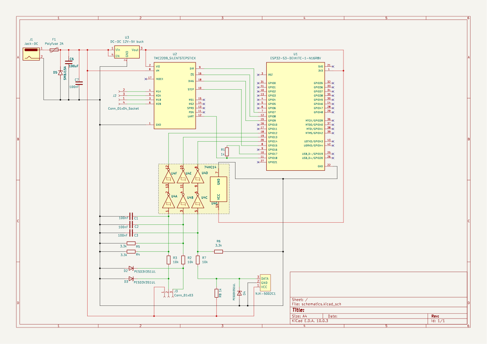
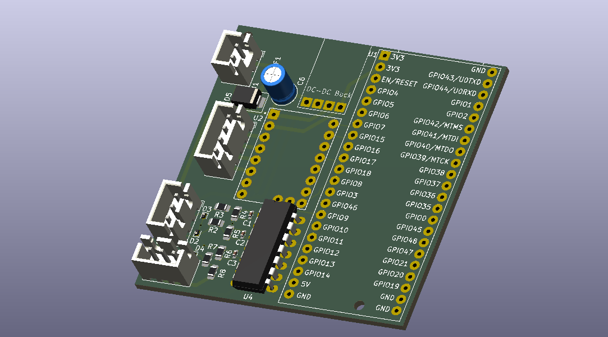
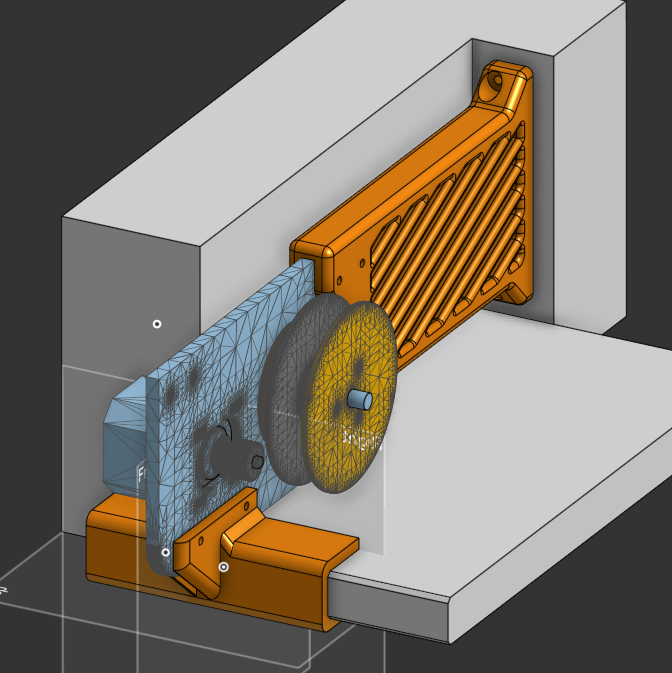
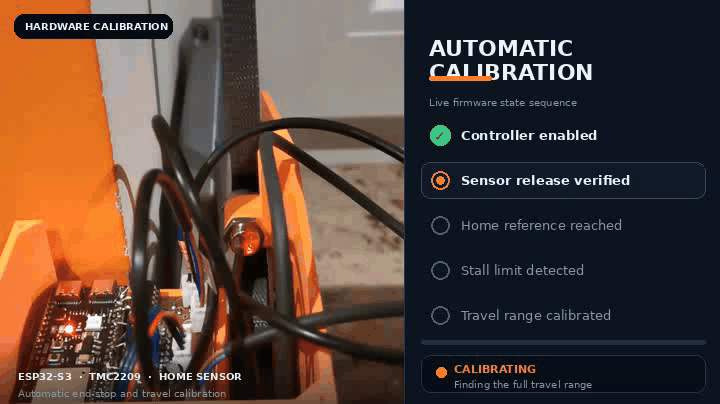

# Window Blinds Controller

ESP32-S3 based embedded controller for motorized window blinds, built with C++/ESP-IDF, TMC2209 stepper control, FreeRTOS event-driven architecture, MQTT integration, custom KiCad PCB, and custom mechanical parts.

  
  
  

  

## What this project demonstrates

- Embedded C++ architecture using separated modules and interfaces
- ESP32-S3 firmware development with ESP-IDF and PlatformIO
- FreeRTOS task-based design with a central command/event queue
- Stepper motor control using RMT pulse generation and PCNT position tracking
- TMC2209 UART driver configuration and DIAG/stall event handling
- Homing, calibration, soft limits, stall recovery, and fault-state handling
- MQTT-based smart-home command interface
- Unit testing with PlatformIO/Unity and fake hardware abstractions
- Custom KiCad schematic and PCB design
- Custom mechanical design: CNC aluminium motor/rope holder and 3D printed enclosure
- Doxygen API documentation
- Project planning using Jira and draw.io diagrams

---

## Hardware

Main components:

| Component | Purpose |
|---|---|
| ESP32-S3 | Main MCU, Wi-Fi, FreeRTOS firmware |
| TMC2209 | Stepper motor driver with UART configuration and DIAG/stall signal |
| Nema 17 Stepper motor | Blind movement |
| NJK-5002C Home/reference sensor | Calibration and homing |
| Wall buttons | Local manual control |
| Custom PCB | Power, MCU, driver, sensor, and connector integration |

## Mechanical design

The project also includes custom mechanical parts:

- CNC aluminium motor and rope holder for the blind mechanism
- 3D printed front/back mounting holders for aluminium
- 3D printed electronics case
- 3D printed cover
- CAD models and exported STL/STEP files

## Documentation and planning

- Doxygen configuration for generated C++ API documentation
- draw.io diagrams for system architecture and firmware flow
- Jira used for task planning, issue tracking, and development organization
